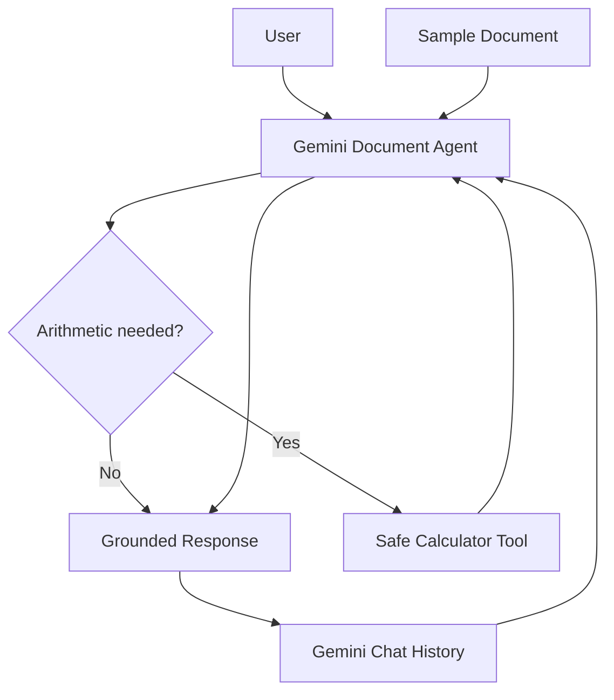

# PointStar Developer Intern Assessment - Part 3 (Gemini)

**Candidate:** Aw Jia Yi

This repository implements the practical evaluation for the PointStar Developer Intern assessment using the **Google GenAI Python SDK (Gemini API)**.

The agent demonstrates:

- Document-grounded question answering
- Short-term conversation memory
- Autonomous tool selection
- A safe calculator tool
- Hallucination guardrails
- Logging, error handling, and unit tests
- Retry with exponential backoff for temporary API failures
- Model fallback for quota/service availability issues

## Architecture



## Why Gemini?

The assessment explicitly allows raw Gemini API calls. This implementation uses the current `google-genai` Python SDK.

Gemini's Python SDK supports automatic function calling. The `calculator` Python function is exposed as a tool and Gemini decides whether it is necessary. The application does not use keyword rules such as:

```python
if "calculate" in question:
    calculator(...)
```

## Conversation Memory

The application uses a Gemini chat session. The chat object maintains the conversation history during the current program session.

Example:

```text
You: My name is Jia Yi.
Agent: Nice to meet you, Jia Yi.

You: What is my name?
Agent: Your name is Jia Yi.
```

Type `reset` to create a fresh chat session and clear short-term memory.

## Grounding Guardrail

The single sample document is included in the system instruction.

For document-related questions, the agent is instructed to use only facts in the document. If the requested information is absent, it should answer:

> The provided document does not contain this information.

## Safe Calculator Tool

The calculator uses Python's `ast` parser and an allowlist of arithmetic operators. It intentionally does **not** use `eval()`.

Whenever Gemini actually calls the calculator, the terminal prints:

```text
[Agent Tool Call] Calculator: 14 - 5
```

This makes the tool decision visible during the demo.

## Project Structure

```text
PointStar_Part3_Document_Agent_Gemini_Aw_Jia_Yi/
├── data/
│   └── sample_document.txt
├── src/
│   ├── __init__.py
│   ├── agent.py
│   ├── document_loader.py
│   └── tools.py
├── tests/
│   ├── test_document_loader.py
│   └── test_tools.py
├── .env.example
├── .gitignore
├── main.py
├── README.md
└── requirements.txt
```

## Setup

### 1. Create a Gemini API key

Create a Gemini API key in Google AI Studio and keep it private.

### 2. Create a virtual environment

Windows:

```powershell
python -m venv .venv
.venv\Scripts\activate
```

### 3. Install dependencies

```powershell
pip install -r requirements.txt
```

### 4. Create `.env`

Copy `.env.example` to `.env`:

```env
GEMINI_API_KEY=your_real_key_here
GEMINI_MODEL=gemini-3.8-flash
GEMINI_FALLBACK_MODEL=gemini-3.7-flash
```

Never commit `.env` to GitHub.

### 5. Run tests

```powershell
python -m pytest -q
```

### 6. Run the agent

```powershell
python main.py
```

## Demo Tests

### Test 1 - Conversation memory

```text
My name is Jia Yi.
What is my name?
```

Expected: The agent remembers `Jia Yi`.

### Test 2 - Document grounding

```text
How many annual leave days do employees receive?
```

Expected: `14 days`.

### Test 3 - Autonomous tool decision

```text
If I have 14 annual leave days and use 5 days, how many days remain?
```

Expected:
- Terminal shows `[Agent Tool Call] Calculator: 14 - 5`
- Agent answers `9 days`.

### Test 4 - Hallucination guardrail

```text
Does the company provide free accommodation?
```

Expected:

```text
The provided document does not contain this information.
```

### Test 5 - Reset memory

```text
reset
What is my name?
```

Expected: After reset, the agent should no longer know the user's name from the previous chat.

## Trade-offs

### Direct document injection vs RAG
The assessment requires only one sample document, so direct grounding is intentionally simple. For many or large documents, a production solution should use chunking, embeddings, retrieval, and source citations.

### Chat memory vs persistent memory
The Gemini chat session provides transparent short-term memory. It resets when the app closes. Production use could persist selected memory in Redis or a database.

### Automatic tool calling vs custom orchestration
Automatic function calling keeps the assessment implementation concise while still demonstrating an agent making a tool-use decision. A larger workflow could use explicit orchestration or LangGraph-style state management.

## Interview Talking Point

> Gemini decides whether the calculator is necessary, while the application controls exactly what the calculator is allowed to execute. This keeps the decision agentic but the execution boundary deterministic and safe.
